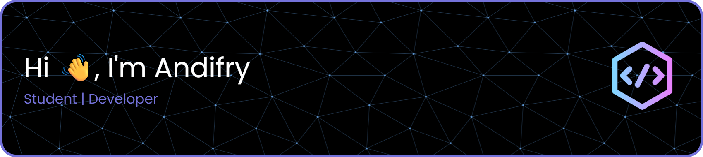

  

<!-- <h1 align="center">Hi 👋, I'm Andifry</h1> -->

  

  🎓 Informatics Student at Universitas Internasional Semen Indonesia (UISI)  
  💻 Passionate about Technology & Digital Solutions

---

### 🚀 About Me

- 🎓 Informatics (Computer Science) student at UISI
- 💡 Interested in **Frontend & Backend Development (Full-Stack)**
- 🔍 Passionate about building user-friendly and efficient systems
- 📈 Currently improving skills in web development and system design

---

### 🧠 Currently Learning

- 🗄️ SQL & Database Design
- ⚙️ Backend Development
- 🎨 Frontend Development (UI/UX basics)
- 📊 Data Structures & Algorithms

---

### 🛠️ Tech Stack

  
  
  
  
  
  
  
  
  
  
  
  
  
  
  
  

---

### 📊 GitHub Stats

  
  

---

### 🧩 Top Languages

  

---

### 🏆 GitHub Trophy

  

---

### 📫 Connect With Me

  
  
  

---

### ⚡ Fun Fact

> I enjoy turning simple ideas into real digital solutions 🚀

---

  ⭐️ From <b>Andifry</b> — keep learning, keep building!

---

###

<picture>
  <source media="(prefers-color-scheme: dark)" srcset="https://raw.githubusercontent.com/andifry7/andifry7/output/pacman-contribution-graph-dark.svg">
  <source media="(prefers-color-scheme: light)" srcset="https://raw.githubusercontent.com/andifry7/andifry7/output/pacman-contribution-graph.svg">
  
</picture>

###

<!--
**andifry7/andifry7** is a ✨ _special_ ✨ repository because its `README.md` (this file) appears on your GitHub profile.

Here are some ideas to get you started:

- 🔭 I’m currently working on ...
- 🌱 I’m currently learning ...
- 👯 I’m looking to collaborate on ...
- 🤔 I’m looking for help with ...
- 💬 Ask me about ...
- 📫 How to reach me: ...
- 😄 Pronouns: ...
- ⚡ Fun fact: ...
-->
